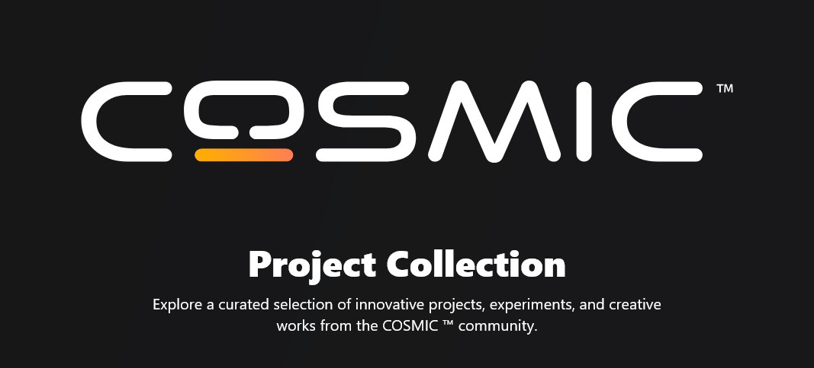

## Applications
| Name | Description | Image |
|---|---|---|
| [Tasks](https://github.com/edfloreshz/tasks) | A simple task management application for the COSMIC desktop. |  |
| [Tweaks for COSMIC™](https://github.com/cosmic-utils/tweaks) |  A tweaking tool for the COSMIC desktop. |  |
| [Calculator](https://github.com/edfloreshz/cosmic-ext-calculator) | A calculator application for the COSMIC desktop. |  |
| [fan-control](https://github.com/wiiznokes/fan-control) | Control your fans with different behaviors. |  |
| [cosmic-webapps](https://github.com/elevenhsoft/WebApps) | Web App Manager for Cosmic desktop written with love and libcosmic. Allow you to simply create web applications from given url working inside separate window of your browser of choice. |  |
| [cosmic-color-picker](https://github.com/PixelDoted/cosmic-color-picker) | A color picker for COSMIC. |  |
| [oboete](https://github.com/mariinkys/oboete) | A simple flashcards application for the COSMIC™ desktop. |  |
| [starry-dex](https://github.com/mariinkys/starrydex) | Pokédex application for the COSMIC™ desktop. |  |
| [cosmic-dirstat](https://github.com/Koranir/cosmic-dirstat) | KDirStat-esque disk usage analyzer using the libcosmic toolkit. |  |
| [forecast](https://github.com/cosmic-utils/forecast) | A simple weather application for the COSMIC™ Desktop |  |
| [cosmic-ext-2048](https://github.com/Kartonrealista/cosmic-ext-2048) | A 2048 game written in libcosmic and Rust |  |
| [cosmicding](https://github.com/vkhitrin/cosmicding) | linkding companion app for COSMIC™ |  |
| [bodev](https://codeberg.org/sgued/bodev) | Low level dev tools |  |

## Applets
| Name | Description | Image |
|---|---|---|
| [cosmic-applet-apps-menu](https://github.com/leb-kuchen/cosmic-applet-apps-menu) | Category based menu for apps. |  |
| [cosmic-applet-places-status-indicator](https://github.com/leb-kuchen/cosmic-applet-places-status-indicator) | Menu for quickly navigating places in the system |  |
| [cosmic-classic-menu](https://github.com/championpeak87/cosmic-classic-menu) | Custom application launcher menu applet |  |
| [clipboard-manager](https://github.com/wiiznokes/clipboard-manager) | Clipboard manager for COSMIC™ |  |
| [cosmic-applet-emoji-selector](https://github.com/leb-kuchen/cosmic-applet-emoji-selector) | Emoji selector |  |
| [cosmic-noise](https://github.com/bq-wrongway/cosmic-noise) | Applet for playing background noise |  |
| [cosmic-applet-ollama](https://github.com/elevenhsoft/cosmic-applet-ollama) | Applet for Ollama |  |
| [cosmic-ext-applet-external-monitor-brightness](https://github.com/maciekk64/cosmic-ext-applet-external-monitor-brightness) | Change brightness of external monitors via DDC/CI protocol |  |
| [cosmic-applet-minimon](https://github.com/Hyperchaotic/minimon-applet) | Applet for displaying CPU and RAM utilization |  |
| [cosmic-ext-applet-system-monitor](https://github.com/D-Brox/cosmic-ext-applet-system-monitor) | Configurable system monitor applet |  |
| [cosmic-ext-applet-gamemode-status](https://github.com/D-Brox/cosmic-ext-applet-gamemode-status) | GameMode status applet |  |
| [cosmic-ext-applet-caffeine](https://github.com/tropicbliss/cosmic-ext-applet-caffeine) | Prevents your screen from going to sleep |  |
| [cosmic-ext-applet-privacy-indicator](https://github.com/D-Brox/cosmic-ext-applet-privacy-indicator) | Privacy Indicator applet for COSMIC |  |
| [cosmic-ext-applet-yt-dlp](https://github.com/D-Brox/cosmic-ext-applet-yt-dlp) | A simple yt-dlp GUI for the COSMIC DE |  |
| [cosmic-applet-logomenu](https://github.com/cappsyco/cosmic-applet-logomenu) | A simple quick access menu to collect your launcher options in one place with the logo of your choice. |  |
| [cosmic-applet-ram-usage](https://github.com/samvv/cosmic-applet-ram-usage) | An applet for the Cosmic DE that displays current total RAM usage |  |

## Services
| Name | Description | Image |
|---|---|---|
| [COSMIC Background Wallpaper](https://github.com/wash2/cosmic_ext_bg_theme) | Unofficial service for syncing the theme with the wallpaper for the COSMIC™ desktop | |

## Themes
| Name | Description | Image |
|---|---|---|
| [catppuccin](https://github.com/catppuccin/cosmic-desktop) | Soothing pastel theme for COSMIC Desktop Environment |  |
| [cosmic-themes](https://github.com/Fingel/cosmic-themes-org-py) | Website for https://cosmic-themes.org |  |

## Scripts
| Name | Description | Image |
|---|---|---|
| [pywal-cosmic-term](https://github.com/dharmik2319/pywal-cosmic-term) | Python script to use your pywal generated color palette with cosmic-term | |

## How to add your project?
To add your project to this list, please open a pull request with your project added to the `applications.ron` or `applets.ron` file.
