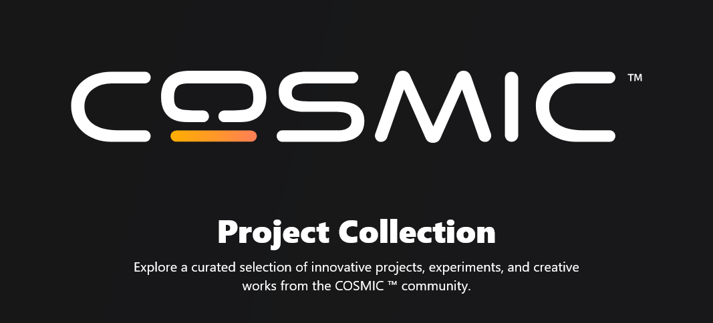

## Applications
| Name | Description | Image |
|---|---|---|
| [Tasks](https://github.com/edfloreshz/tasks) | A simple task management application for the COSMIC desktop. |  |
| [Tweaks for COSMIC™](https://github.com/cosmic-utils/tweaks) |  A tweaking tool for the COSMIC desktop. |  |
| [Calculator](https://github.com/edfloreshz/cosmic-ext-calculator) | A calculator application for the COSMIC desktop. |  |
| [Boards](https://github.com/cosmic-utils/boards) | Boards is a Trello like application for COSMIC |  |
| [Fan Control](https://github.com/wiiznokes/fan-control) | Control your fans with different behaviors. |  |
| [Ethereal Waves](https://github.com/cosmic-utils/ethereal-waves) | libcosmic, gstreamer based music player |  |
| [cosmic-webapps](https://github.com/cosmic-utils/web-apps) | Web App Manager for Cosmic desktop written with love and libcosmic. Allow you to simply create web applications from given url working inside separate window of your browser of choice. |  |
| [AppHub](https://github.com/cosmic-utils/app-hub) | AppHub is a Linux desktop application that simplifies the installation and management of .appImage packages |  |
| [cosmic-color-picker](https://github.com/PixelDoted/cosmic-color-picker) | A color picker for COSMIC. |  |
| [Noctua](https://github.com/cosmic-utils/noctua) | An image viewer application for the COSMIC™ desktop |  |
| [Cupola](https://github.com/cosmic-utils/cupola) | An image viewer built for COSMIC with libcosmic. |  |
| [Oboete](https://github.com/mariinkys/oboete) | A flashcards application for the COSMIC™ desktop. |  |
| [StarryDex](https://github.com/mariinkys/starrydex) | Pokédex application for the COSMIC™ desktop. |  |
| [Cedilla](https://github.com/mariinkys/cedilla) | A markdown text editor for the COSMIC™ desktop. |  |
| [Stellarshot](https://github.com/cosmic-utils/stellarshot) | A simple backup application using Restic/Rustic for the COSMIC™ desktop. |  |
| [cosmic-dirstat](https://github.com/Koranir/cosmic-dirstat) | KDirStat-esque disk usage analyzer using the libcosmic toolkit. |  |
| [Camera](https://github.com/cosmic-utils/camera) | Camera application for the COSMIC™ desktop environment |  |
| [forecast](https://github.com/cosmic-utils/forecast) | A simple weather application for the COSMIC™ Desktop |  |
| [examine](https://github.com/cosmic-utils/examine) | A system information viewer for the COSMIC™ Desktop |  |
| [cosmic-ext-2048](https://github.com/Kartonrealista/cosmic-ext-2048) | A 2048 game written in libcosmic and Rust |  |
| [cosmicding](https://github.com/vkhitrin/cosmicding) | linkding companion app for COSMIC™ |  |
| [Chronos](https://github.com/cosmic-utils/chronos) | Chronos is a simple and intuitive Pomodoro timer for Linux |  |
| [Accounts](https://github.com/cosmic-utils/accounts) | A library for COSMIC online account management. |  |
| [configurator](https://github.com/cosmic-utils/configurator) | dconf alternative |  |
| [bodev](https://codeberg.org/sgued/bodev) | Low level dev tools |  |
| [Subscribi](https://codeberg.org/Tony4dev/subscribi) | Track all your subscriptions easily (and privately) |  |
| [Cupola](https://codeberg.org/bhh32/cupola) | An image viewer built for the COSMIC Desktop. |  |
| [Maré Player](https://github.com/glima/mare-player) | TIDAL music streaming for COSMIC™ — Hi-Res FLAC playback, spectrum visualizer, and MPRIS integration. Also builds as a panel applet. |  |
| [COSMIC WallShift](https://github.com/nagyrenato/cosmic-wallshift) | Automatically switches your wallpaper when the system theme toggles between Light and Dark mode. |  |
| [Super STT - With COSMIC Visualizer](https://github.com/jorge-menjivar/super-stt) | Super STT enables effortless voice-to-text in any application, using the most advanced speech models that run 100% locally. |  |
| [Toot](https://github.com/cosmic-utils/toot) | Mastodon client for COSMIC | |
| [Calendar](https://github.com/cosmic-utils/calendar) | A calendar application for the COSMIC desktop | |
| [GitWork](https://github.com/cosmic-utils/git-work) | A GitHub notifications applet for the COSMIC desktop | |
| [observatory](https://github.com/cosmic-utils/observatory) | An in-development system monitor application for the COSMIC desktop environment | |
| [andromeda](https://github.com/cosmic-utils/andromeda) | Disk management utility for the COSMIC™ desktop environment | |
| [cosmic-ext-storage](https://github.com/cosmic-utils/cosmic-ext-storage) | A Disk Utility for the Comsic Desktop | |
| [enroll](https://github.com/cosmic-utils/enroll) | Fingerprint management | |
| [Wizard](https://github.com/cosmic-utils/wizard) | Deb packages installer made with magic for the COSMIC™ desktop! | |

## Applets
| Name | Description | Image |
|---|---|---|
| [clippy-land](https://github.com/k33wee/clippy-land) | COSMIC panel applet for keeping a history of recently copied text and images |  |
| [cosmic-applet-apps-menu](https://github.com/leb-kuchen/cosmic-applet-apps-menu) | Category based menu for apps. |  |
| [cbar](https://github.com/alexandreprates/cbar) | Scriptable COSMIC panel applet for local plugins, live panel text, popup actions, and catalog-based plugin discovery. |  |
| [cosmic-applet-places-status-indicator](https://github.com/leb-kuchen/cosmic-applet-places-status-indicator) | Menu for quickly navigating places in the system |  |
| [cosmic-ext-classic-menu](https://github.com/championpeak87/cosmic-ext-classic-menu) | Menu applet for launching applications |  |
| [clipboard-manager](https://github.com/cosmic-utils/clipboard-manager) | Clipboard manager for COSMIC™ |  |
| [cosmic-applet-emoji-selector](https://github.com/leb-kuchen/cosmic-applet-emoji-selector) | Emoji selector |  |
| [cosmic-noise](https://github.com/bq-wrongway/cosmic-noise) | Applet for playing background noise |  |
| [cosmic-applet-ollama](https://github.com/elevenhsoft/cosmic-applet-ollama) | Applet for Ollama |  |
| [cosmic-ext-applet-external-monitor-brightness](https://github.com/cosmic-utils/cosmic-ext-applet-external-monitor-brightness) | Change brightness of external monitors via DDC/CI protocol |  |
| [cosmic-applet-minimon](https://github.com/cosmic-utils/minimon-applet) | Applet for displaying CPU and RAM utilization |  |
| [cosmic-ext-applet-system-monitor](https://github.com/D-Brox/cosmic-ext-applet-system-monitor) | Configurable system monitor applet |  |
| [cosmic-ext-applet-gamemode-status](https://github.com/D-Brox/cosmic-ext-applet-gamemode-status) | GameMode status applet |  |
| [cosmic-ext-applet-caffeine](https://github.com/tropicbliss/cosmic-ext-applet-caffeine) | Prevents your screen from going to sleep |  |
| [cosmic-ext-applet-privacy-indicator](https://github.com/D-Brox/cosmic-ext-applet-privacy-indicator) | Privacy Indicator applet for COSMIC |  |
| [cosmic-ext-applet-yt-dlp](https://github.com/D-Brox/cosmic-ext-applet-yt-dlp) | A simple yt-dlp GUI for the COSMIC DE |  |
| [cosmic-ext-applet-logomenu](https://github.com/cosmic-utils/cosmic-ext-applet-logomenu) | A simple quick access 'Logo menu' to collect your launcher options in one place with the logo of your choice. |  |
| [cosmic-applet-ram-usage](https://github.com/samvv/cosmic-applet-ram-usage) | An applet for the Cosmic DE that displays current total RAM usage |  |
| [cosmic-ext-applet-vitals](https://github.com/Coinio/cosmic-ext-applet-vitals) | A minimal configurable applet to display basic system resource usage |  |
| [cosmic-applet-music-player](https://github.com/Ebbo/cosmic-applet-music-player) | A Music Player control applet for COSMIC panel |  |
| [cosmic-applet-package-updater](https://github.com/Ebbo/cosmic-applet-package-updater) | Package update notifier applet for the COSMIC desktop |  |
| [cosmic-applet-systemstats](https://github.com/rylan-x/cosmic-applet-systemstats) | Compact system monitor with CPU/GPU temps, memory, and network speeds |  |
| [cosmic-ext-applet-dict](https://github.com/cosmic-utils/cosmic-ext-applet-dict) | An English language dictionary applet, perfect for quick access searching for words and definitions, or cycling through some random words to enrich your knowledge of the English language! |  |
| [cosmic-ext-connected](https://github.com/nwxnw/cosmic-connect-applet) | Phone connectivity applet using KDE Connect |  |
| [cosmic-ext-flux](https://github.com/franz-net/cosmic-ext-flux) | Live wallpaper engine — play video and GIF files as your desktop background with GPU-accelerated decoding, multi-monitor support, and a panel applet for playback controls. |  |
| [cosmic-applet-mare](https://github.com/glima/mare-player) | TIDAL music streaming applet for COSMIC™ — Hi-Res audio, spectrum visualizer, and MPRIS integration |  |
| [cosmic-pomodoro](https://github.com/petar030/cosmic-pomodoro) | Simple Pomodoro applet for COSMIC Desktop |  |
| [cosmic-ext-whether](https://github.com/nwxnw/cosmic-ext-whether) | Weather applet with NWS and Open-Meteo forecasts |  |
| [cosmic-ext-applet-mounter](https://github.com/uutzinger/cosmic-ext-applet-mounter) | Manage online mounts and offline mirrors for OneDrive, Google Drive, Box, and SMB |  |
| [cosmic-ext-app-switcher](https://github.com/j0rdiun/cosmic-ext-app-switcher) | macOS-style Super+Tab app switcher for COSMIC — horizontal icon strip overlay with Dark, Light, Frosted, and Midnight themes |  |
| [cosmic-ext-applet-eyedropper](https://github.com/nalladev/cosmic-ext-applet-eyedropper) | Eyedropper applet for cosmic desktop. Pick colours from the screen. |  |
| [cosmic-power-monitor](https://github.com/AceMythos/cosmic-power-monitor) | Battery power monitor applet for the COSMIC™ desktop |  |
| [cosmic-ext-applet-now-playing](https://github.com/cosmic-utils/cosmic-ext-applet-now-playing) | Shows active media in the panel |  |
| [cosmic-ai-panel](https://github.com/levlandon/cosmic-ai-panel) | AI assistant panel applet for COSMIC desktop with streaming responses, markdown rendering, and model switching |  |
| [cosmic-applet-rotation](https://github.com/armaaar/cosmic-applet-rotation) | Automatic screen rotation for devices with accelerometers |  |
| [cosmic-applet-arch](https://github.com/nick42d/cosmic-applet-arch) | Applet to display Arch Linux package update status |  |
| [cosmic-cpufreq](https://github.com/skylord123/cosmic-cpufreq) | CPU frequency monitor and governor control applet |  |
| [cosmic-applet-claude-usage](https://github.com/osterbergsimon/cosmic-applet-claude-usage) | Minimal panel applet showing Claude Code usage as a quiet, color-coded indicator |  |
| [gui-scale-applet](https://github.com/cosmic-utils/gui-scale-applet) | COSMIC applet for Tailscale |  |
| [cosmic-ext-applet-sysinfo](https://github.com/cosmic-utils/cosmic-ext-applet-sysinfo) | Simple system info applet for cosmic. |  |
| [cosmic-ext-applet-weather](https://github.com/cosmic-utils/cosmic-ext-applet-weather) | Simple weather info applet for cosmic. |  |
| [cosmic-ext-applet-pomodoro](https://github.com/cosmic-utils/cosmic-ext-applet-pomodoro) | A pomodoro timer applet for the COSMIC desktop |  |
| [cosmic-ext-applet-vigil](https://github.com/cosmic-utils/cosmic-ext-applet-vigil) | Screen-awake applet for the COSMIC™ desktop — prevent your screen from sleeping with preset durations or indefinite mode |  |
| [kdeconnect](https://github.com/cosmic-utils/kdeconnect) |  | |
| [cosmic-ssh-launcher](https://github.com/raph-ael/cosmic-ssh-launcher) | SSH launcher panel applet — quick access to hosts from ~/.ssh/config | |
| [cosmic-ext-applet-nixos-update](https://github.com/cosmic-utils/cosmic-ext-applet-nixos-update) |  | |
| [cosmic-ext-applet-drives](https://github.com/cosmic-utils/cosmic-ext-applet-drives) |  | |
| [cosmic-speech-to-text](https://github.com/raph-ael/cosmic-speech-to-text) | Speech-to-text panel applet — record voice and type transcribed text into any app. Supports Mistral, OpenAI, and local whisper.cpp | |
| [cosmic-keepass](https://github.com/raph-ael/cosmic-keepass) | KeePass password manager panel applet — search, copy, and manage passwords from .kdbx databases | |

## Services
| Name | Description | Image |
|---|---|---|
| [COSMIC Background Wallpaper](https://github.com/wash2/cosmic_ext_bg_theme) | Unofficial service for syncing the theme with the wallpaper for the COSMIC™ desktop | |

## Themes
| Name | Description | Image |
|---|---|---|
| [catppuccin](https://github.com/catppuccin/cosmic-desktop) | Soothing pastel theme for COSMIC Desktop Environment |  |
| [cosmic-themes](https://github.com/Fingel/cosmic-themes-org-py) | Website for https://cosmic-themes.org |  |
| [cosmic-ext-brand-wallpapers](https://github.com/cosmic-utils/cosmic-ext-brand-wallpapers) | COSMIC™ Brand Wallpapers |  |
| [candyfactory-cosmic](https://github.com/BonfireAI/candyfactory-cosmic) | Dark + light COSMIC themes with matching cosmic-term scheme | |
| [cosmic-ext-themes](https://github.com/cosmic-utils/cosmic-ext-themes) | My themes for COSMIC. | |

## Scripts
| Name | Description | Image |
|---|---|---|
| [pywal-cosmic-term](https://github.com/dharmik2319/pywal-cosmic-term) | Python script to use your pywal generated color palette with cosmic-term | |
| [cosmic-ext-window-helper](https://github.com/lapause/cosmic-ext-window-helper) | Utility interacting with COSMIC™ Wayland compositor to provide easy scriptable access to toplevel windows, allowing shortcut-triggerable custom actions: run-or-raise, batch hiding or closing... | |

## How to add your project?
To add your project to this list, please open a pull request with your project added to the `applications.ron` or `applets.ron` file.
